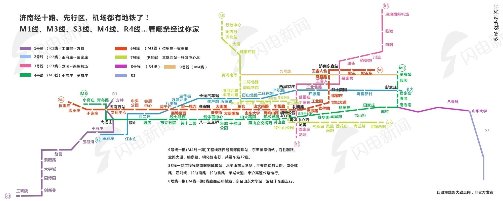

# learnSpingBoot
   本文为了学习springboot的零基础学习，将学习过程记录下来，学习了git的用法以及makedown一种轻量级标记语言，因此，首先将makedown的语法记录一下
# makedown
## 1、标题
   - # 一级标题
   - ## 二级标题
   - ### 三级标题
   - #### 四级标题
   - ##### 五级标题
   - ###### 六级标题
## 2、段落格式
   - 换行（末尾添加两个空格加回车）
      - 换行演示  
      换行演示
   - 字体  
      - *斜体*
      - **粗体**
      - ***粗斜体***
   - 分割线
      
      ***
   - 删除线  
      ~~删除线~~
## 3、列表
   - 无需裂变
      - 无序列表演示
      - 无序列表演示
      - 无序列表演示
   - 有序列表
      1. 有序列表演示
      2. 有序列表掩饰
      3. 有序列表演示
## 4、区块
   - 基本用法  
      >基本用法dafjdlsaj fdjafdlksjfldjfasldj  
       fdjsafldjasflkdjsafldjfdkjafsldkjf
       fdas fasdfasdfasdfdsf 
   - 嵌套区块
      >第一层
      >>第二层
      >>
      >>>第三层
   - 列表中使用区块
      - 列表一
         >列表一的内容就的发生率肯德基发了时代峻峰
         >jfldsjfdfdlsajfdlkjfl
      - 列表二
## 4、代码
  - 基本用法  
    `print(hello workd)`
  - 代码区块
    ```javascript
    $(document).ready(function () {
        alert('RUNOOB');
    });
    ```
##  5、链接
  - 基本用法  
    这是一个链接[菜鸟教程](http://wwww.baidu.com)
##  6、图片
  
##  7、表格
|  表头   | 表头  |
|  ----  |  ----  |
|  单元格   |  单元格   |
|  单元格   |  单元格   |

   >
| 左对齐 | 右对齐 | 居中对齐 |
| :-----| ----: | :----: |
| 单元格 | 单元格 | 单元格 |
| 单元格 | 单元格 | 单元格 |

##	8、未完待续


